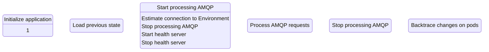

Conductor
===

Abstract
---

This application is intended to provide a level of autonomy during resource 
allocation and their further discovery and management.

The basic pipeline will looks like this:

